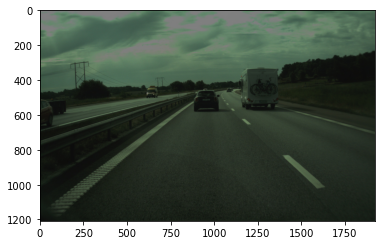
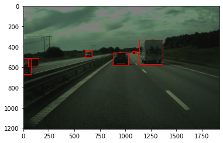
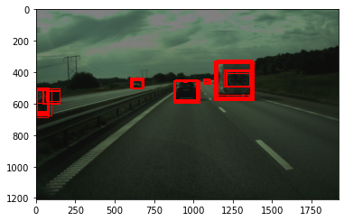
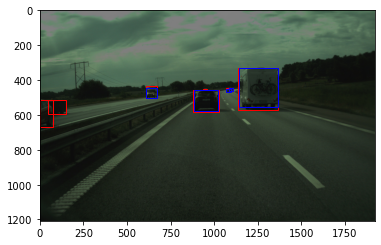
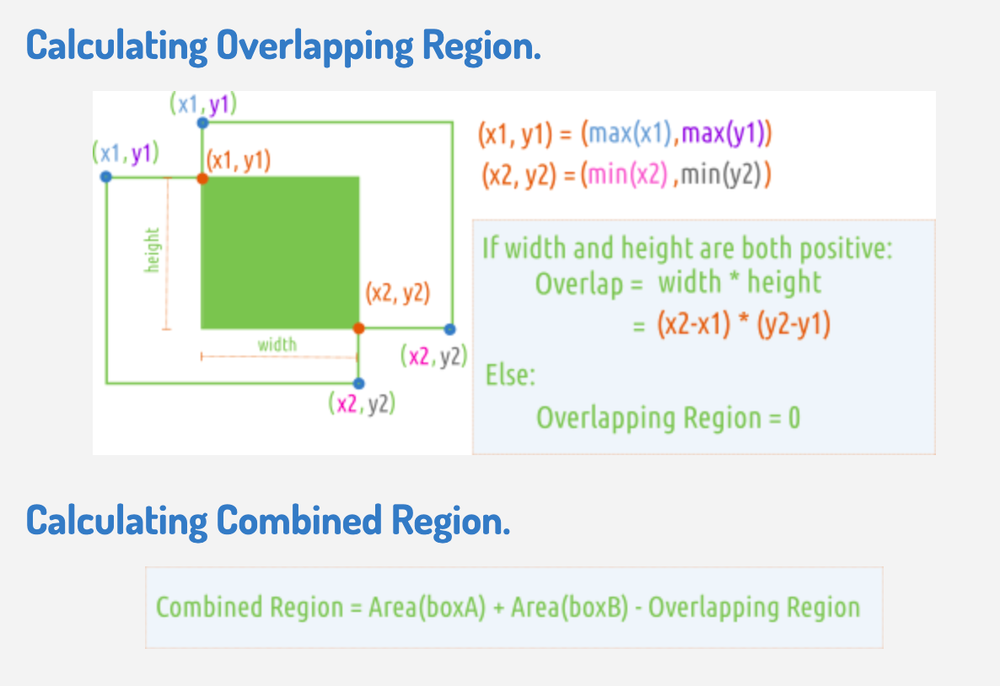

# Data Management 
In this exercise, you will check the consistency of annotations for a selected image. You are provided with one image and for this image there are a number of different judgements (a single judgement is one persons opinion about what the annotation should look like).  

For the image you have a corresponding .json file that contains all of the judgements for said image. In turn, each judgement corresponds to a list of objects, where each object contains a number of different keys that inform you about the object-class, position of the extreme points (top, right, left, bottom) and so on. 

## Tasks 
### 1.1 Load image
- Load image using Matplotlib library's imread() to load image in the form of an array of the pixel 
- Display the image using imshow(). 

### 1.2 Drawing annotations (bouding box coordinates) onto image

In .json file, the Rectangle() draws a rectangle whose dimensions are specified as its parameters xy, width, height. The xy=(x,y) parameter specifies the bottom and left rectangle coordinates.

In order to draw the bounding box using matplotlib.patches.Rectangle((x,  y), width, height) you need to access the coordinates of each edge and get the correct parameters for the rectangle.

- xy = (min_x, min_y)
- width = (max_x - min_x)
- height = (max_y - min_y)

### 2 Draw all boxes avalibale for the same image onto the image

### 3 Draw all boxes from two annotators onto an image. 

Select two annotators and draw the bounding boxes provided by the two annotators on a single image. 

### 4 Compute the IOU between two annotations. 

